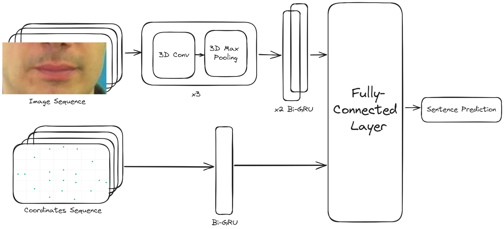

# Lip Reader

## Overview
Lip Reader is a deep learning-based project that recognizes spoken words from silent video footage of lip movements. The model is built using TensorFlow and OpenCV and leverages deep learning techniques for lip-reading tasks.




## Features
- Uses TensorFlow for training and inference
- Processes video frames using OpenCV
- Includes pre-trained weights (handled with Git LFS)
- Implements `wordninja` for word segmentation
- Uses `Levenshtein` distance for text evaluation

## Installation
To set up the environment, run the following:
```bash
pip install -r requirements.txt
```

### Additional Dependencies
If not included in `requirements.txt`, install these manually:
```bash
pip install opencv-python imageio gdown wordninja Levenshtein
```

## Dataset and Pre-trained Model
The project downloads datasets and pre-trained models using `gdown`. If needed, manually download the required files and place them in the appropriate directories.

## Usage
### Running the Lip Reader Model
```bash
python lip_reader.py
```
This script will:
1. Load the pre-trained model
2. Process input video frames
3. Predict spoken words based on lip movements


## Model Details
- **Architecture:** Deep learning model using TensorFlow/Keras
- **Evaluation:** Uses `Levenshtein` distance for accuracy measurement
- **Preprocessing:** OpenCV for frame extraction and image processing

## GPU Support
The script checks for available GPUs and utilizes them for training if available.

---

Let me know if you'd like any modifications or additions! 🚀
📧 [Email Me](abdosaaed749@gmail.com)

